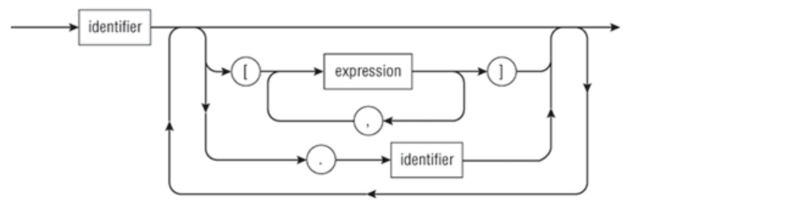

# Type Checking

## Goals and Approach
> - Incorporate type checking into the frontend. 

### Parsing a variable
> ```
> variable          =  identifierObject | identifierObject arrayExpression
> ```
> ```
> arrayExpression   = "[" arrayIndex "]"
> ```
> ```
> arrayIndex        = expression | arrayIndexes "," expression
> ```
> ```
> identifierObject  = identifier | identifierObject "." identifier
> ```
> 
